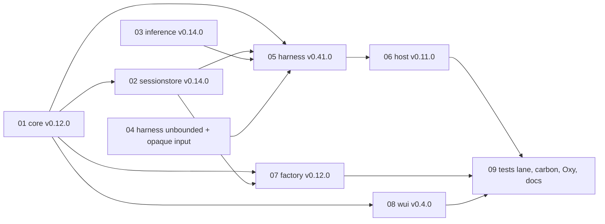

# Principal, metadata, presenter and unbounded execution: master implementation plan

> **For Claude:** REQUIRED SUB-SKILL: Use superpowers:executing-plans to implement each linked plan task-by-task. Resume from the progress table at the bottom.

**Goal:** Ship per-command principal and message metadata end to end with a harness
Message Presenter, plus the four behaviours Oxy currently patches into Looprig, so Oxy can
run on plain published releases with multi-user attribution.

**Architecture:** Two approved designs drive nine per-module plans that release leaf to
root. New optional Core wire members are carried unchanged through SessionStore, Host and
Harness. Factory alone stamps the verified principal. A capability token keeps old Hosts
safe. Harness renders selected fields once into the journaled user message.

**Tech stack:** Go 1.26.8 (`GOTOOLCHAIN=go1.26.8 GOWORK=off`), TypeScript/React (wui),
the workspace release rules in `/Users/ipotter/code/looprig/AGENTS.md`.

---

## Designs (binding)

- `2026-09-25-message-principal-metadata-presenter-design.md`: principal on all five
  command kinds, metadata on create/input, presenter, visibility, rollout.
- `2026-09-25-unbounded-execution-and-opaque-tool-input-design.md`: `loop.Unlimited`,
  zero hustle timeout, opaque tool input, inference call with no execution ceiling.

## Plans and order

| # | Plan | Module / release | Depends on | Can run in parallel with |
|---|---|---|---|---|
| 01 | `2026-09-25-impl-01-core-v0.12.0.md` | core v0.12.0 | — | 03, 04 |
| 02 | `2026-09-25-impl-02-sessionstore-v0.14.0.md` | sessionstore v0.14.0 | 01 published | 03, 04 |
| 03 | `2026-09-25-impl-03-inference-v0.14.0.md` | inference v0.14.0 | — | 01, 02, 04 |
| 04 | `2026-09-25-impl-04-harness-unbounded-and-opaque-input.md` | harness main (no tag) | — | 01, 02, 03 |
| 05 | `2026-09-25-impl-05-harness-v0.41.0-principal-metadata-presenter.md` | harness v0.41.0 (releases 04 + 05) | 01, 02, 03 published; 04 merged | — |
| 06 | `2026-09-25-impl-06-host-v0.11.0.md` | host v0.11.0 | 05 published | 07, 08 |
| 07 | `2026-09-25-impl-07-factory-v0.12.0.md` | factory v0.12.0 | 01, 02 published | 06, 08 |
| 08 | `2026-09-25-impl-08-wui-v0.4.0.md` | wui v0.4.0 | 01 published | 06, 07 |
| 09 | `2026-09-25-impl-09-tests-lane-and-consumers.md` | tests v0.14.0, carbon, Oxy, docs corpus | 06, 07, 08 published | — |

Dependency graph:

## Rules for every plan

- Work on each repository's local `main`. Preserve unrelated branches and worktrees.
- Before a dependency is published, develop against local checkouts through an
  **uncommitted** `go.work`. Never add a `replace` directive and never commit `go.work`.
- Standalone verification before any release: `GOWORK=off GOTOOLCHAIN=go1.26.8 go test ./...`
  plus the repository's native checks (`make check` or equivalent).
- Commits use conventional messages with **no Co-Authored-By trailer**.
- Every push and tag **requires owner confirmation** at the time of release. After a tag
  exists on the remote, dependents may pin it; then update `repositories.mk`, `go.work` and
  `AGENTS.md` (the outer repository is not committed by the agent).
- Absent principal and metadata must stay byte-identical on the wire and in journals;
  each plan carries a golden test proving it.
- One-way upgrade: once any stamped or presented record is stored, no process sharing
  that store may roll back below harness v0.41.0 / sessionstore v0.14.0. Release notes
  must say so.

## Rollout order for deployments (from the design)

1. Upgrade every Host to host v0.11.0.
2. Upgrade Factory to v0.12.0.
3. Check every registered Host advertises `hostlink.attribution.principal`.
4. Enable `factory.WithPrincipalStamping()`.

## Progress

Update this table as work lands. `impl-NN` status: not started, in progress (branch or
commit), merged, released (tag).

| Plan | Status | Notes |
|---|---|---|
| 01 core v0.12.0 | released (`8a6197f`, tag `f95f298`) | remote `main` and annotated tag verified |
| 02 sessionstore v0.14.0 | released (`96e4621`, tag `46b7e9b`) | remote `main` and annotated tag verified; v3 attributed rows require every Factory and Host reader to use sessionstore >= v0.14.0 |
| 03 inference v0.14.0 | released (`8de21fa`, tag `7af949a`) | remote `main` and annotated tag verified. Known limit: `llm` gemini, bedrock and chutes build their own http.Client, so the marker does not lift their ceilings; plan 09 must check Oxy's providers (an llm follow-up if needed) |
| 04 harness unbounded + opaque input | merged (`ca6b5a5`, local `main`) | implemented and independently reviewed; ships with harness v0.41.0 in impl-05 |
| 05 harness v0.41.0 | in progress (local `main`) | rollback is lossy, not fail-closed (design §9.1); owner acknowledgement is recorded in the handoff |
| 06 host v0.11.0 | plan written | |
| 07 factory v0.12.0 | plan written | incapable owner → 422 |
| 08 wui v0.4.0 | plan written (code unverified) | metadata pre-check mirrors Core's check order (review fix) |
| 09 tests, carbon, Oxy, docs | plan written (code unverified; A3/A4/A5 partly outlines) | covers the silent-drop copies in tests `pooled.go`, carbon `department.go`, Oxy `department.go` |

## Cross-plan review (2026-09-25)

Checked every definer/consumer pair across plans 01-09 against the designs and the source
at the current tags. Fixes applied in the plans: Factory's incapable-owner status is 422 and
a different-subject retry is `command_rejected` 409 (plans 02, 09); `ErrMetadataUnsupported`
lives in `factory/identity`, not `internal/admission` (plan 09); the create's columns ride
`AdmitPublicCreateRequest` (plans 07, design §9.11); host's grep for the harness members
matches the `coresessionwire` alias (plan 06); wui's metadata check order mirrors Core's
(plan 08); the harness release annotation placeholder and the `uuid.MustNew` /
`identityAgency` placeholders are replaced (plan 05). Plans 05-09 carry an "Unverified
code" note: their code was not compiled or run while planning.

Owner decisions still open: the "lossy on rollback" wording (design §9.1, plan 05); 422 vs
409 for the incapable owner (design §9.9); `/v1/capabilities` `command_principal` meaning
"this deployment stamps" rather than a constant `true` (plan 07 Task 10); Oxy's Part C
start branch and interim-table export (plan 09).

## Owner decisions recorded 2026-09-25

Rollback is lossy and forbidden (documented); incapable owner → 422; `command_principal` =
this Factory stamps; nats-server/v2 allowed as a direct test-only import in `tests`. Still open
(ask when reached): Oxy Part C branch base, exporting Oxy's interim audit table, Oxy's audit
policy, and any Oxy provider without native structured output.
